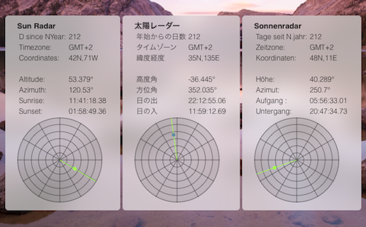

# sunradar

An [Uebersicht](http://tracesof.net/uebersicht/) Widget displaying:

- Days past since New Year
- Timezone (set in the OS X preferences pane, not based on the coordinates)
- Coordinates
- Altitude of the sun
- Azimuth of the sun
- Sunrise time
- Sunset time

Preferences to be set by the user:
- language (Currecntly available in English, Japanese and German)
- coordinates (long/lat)
- radius of the radar
- position of the widget (top/left margin)

The point marking the sun turns blue when the altitude is negative.
